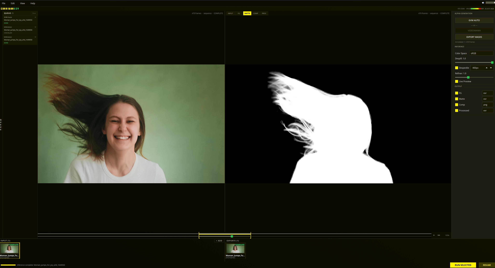
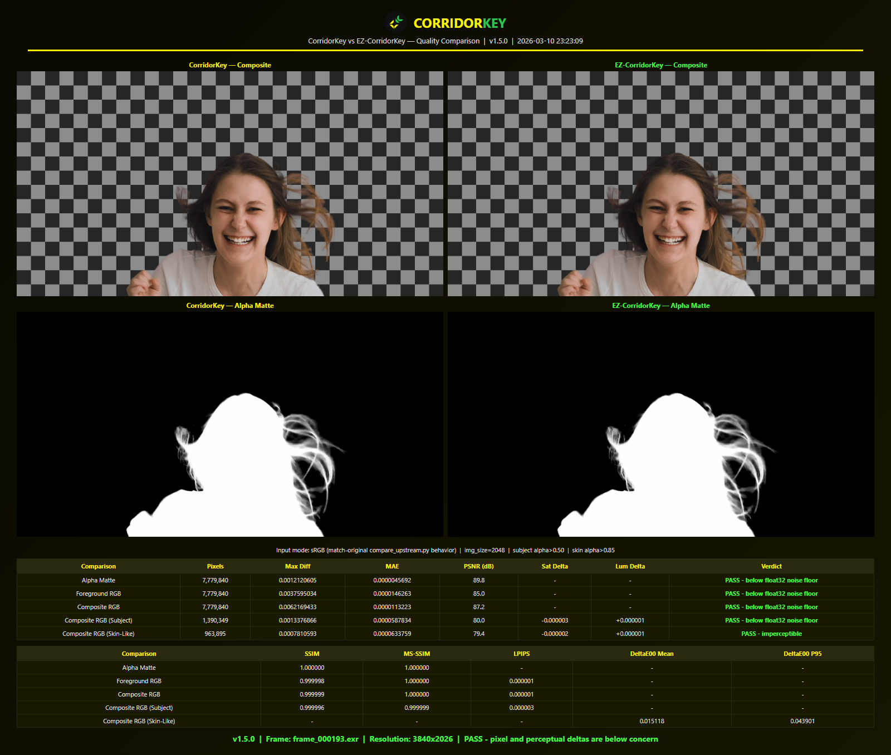

<p><a href="../../README.md"></a> <a href="README.fr.md"></a> <a href="README.de.md"></a> <a href="README.es.md"></a> <a href="README.it.md"></a> <a href="README.pt.md"></a>  <a href="README.ko.md"></a> <a href="README.zh.md"></a> <a href="README.ru.md"></a> <a href="README.pl.md"></a> <a href="README.tr.md"></a> <a href="README.hi.md"></a> <a href="README.id.md"></a> <a href="README.vi.md"></a> <a href="README.uk.md"></a> <a href="README.zh-Hant.md"></a></p>

# EZ-CorridorKey **v2.1.2**

[](https://github.com/edenaion/EZ-CorridorKey/releases/latest)
[](https://github.com/edenaion/EZ-CorridorKey/stargazers)
[](https://creativecommons.org/licenses/by-nc-sa/4.0/)
[](https://discord.gg/TyxNjcWeF3)
[](https://www.ezscape.space)
[]()

> **最新リリース: [v2.1.2](https://github.com/edenaion/EZ-CorridorKey/releases/tag/v2.1.2):** Windows 向けのホットフィックスです。最新の FFmpeg での動画インポートを修正し ([#175](https://github.com/edenaion/EZ-CorridorKey/issues/175))、FFmpeg の修復インストールを安定版ビルドに変更し、更新ボタンを VRAM メーターと重ならない位置に移動しました ([#176](https://github.com/edenaion/EZ-CorridorKey/issues/176))。[完全な changelog](../../CHANGELOG.md) を参照してください。

[Niko Pueringer の CorridorKey](https://github.com/nikopueringer/CorridorKey)向けの完全なデスクトップ GUI です。Corridor Digital による AI chroma keyer で、前景を背景から物理的に分離し、髪、モーションブラー、半透明部分を保持します。

この GUI は、CLI のドラッグアンドドロップ手順を完全なデスクトップアプリに置き換えます。互換性は 100% 維持されており、`python main.py --cli` で元のウィザードを引き続き実行できます。



### 目次

☼ [インストール](#インストール) - デスクトップインストーラー、CLI セットアップ、Docker

☼ [アンインストール](#アンインストール) - アプリをきれいに削除

☼ [アプリケーションレイアウト](#アプリケーションレイアウト) - UI の概要

☼ [クイックスタート](#クイックスタート) - 読み込み、アルファ生成、推論実行

☼ [キーボードショートカット](#キーボードショートカット) - ホットキー一覧

☼ [表示モード](#表示モード) - 出力チャンネルの切り替え

☼ [推論コントロール](#推論コントロール) - パラメーターと出力形式

☼ [ハードウェア要件](#ハードウェア要件) - VRAM、GPU、プラットフォーム情報

☼ [セキュリティ](#セキュリティ) - 検証済みダウンロード、署名済み更新、チェックサム

☼ [ローカライズ](#ローカライズ) - EZ-CorridorKey をあなたの言語に翻訳

☼ [貢献](#貢献とサポート) - 支援とヘルプの方法

[](https://star-history.com/#edenaion/EZ-CorridorKey&Date)

| 機能                | CLI (upstream)             | GUI (このプロジェクト)                              |
| ------------------- | --------------------------- | ---------------------------------------------------- |
| クリップ読み込み    | .bat ファイルにドラッグ    | アプリへドラッグアンドドロップ、または File > Import |
| 推論設定            | ターミナルのプロンプト      | スライダー、ドロップダウン、チェックボックス        |
| 進捗監視            | ターミナルのテキスト出力    | 進捗バー、フレームカウンター、ETA                   |
| 結果プレビュー      | 出力フォルダーを手動で開く  | リアルタイムのデュアルビューアー (入力 vs 出力)     |
| ジョブ管理          | 1 クリップずつ              | バッチ処理付きキュー + フルパイプラインモード       |
| GPU 監視            | なし                        | ブランドバー内のライブ VRAM メーター                |
| キーボードショートカット | なし                   | 20 個以上のホットキー                                |
| サウンドフィードバック | なし                    | 状況に応じた 7 つの効果音                           |
| セッション永続化    | なし                        | 最近のプロジェクト、自動保存                        |
| ペイント / マスク   | 外部ツールで手動            | マスク用の内蔵ブラシ + chroma key holdout           |
| アルファ生成        | なし                        | GVM, BiRefNet, VideoMaMa, MatAnyone2, Chroma Key     |
| Apple Silicon       | MPS のみ                    | MLX アクセラレーション (自動検出)                    |

---

## インストール

### デスクトップアプリインストーラー (推奨)

**Python、git、コマンドラインを扱いたくない場合:** 完全な Windows インストーラー、ポータブル exe、macOS `.pkg` を用意しています。すべて任意で無料です。寄付は継続的な開発の支援になります。

[](https://edenaion.gumroad.com/)

インストーラーには Python runtime、AI モデル、GPU ライブラリがすべて含まれます。設定は不要です。インストールして起動してください。

### ターミナル (CLI) インストール (Windows / macOS / Linux)

1. このリポジトリをクローンまたはダウンロードします。
2. ワンクリックの手順では管理された Python 3.11 を自動で用意して使用するため、`1-install` を使うためだけに Python を事前インストールする必要はありません。
3. お使いのプラットフォーム用インストーラーを実行します。
   ☼ **Windows:** `1-install.bat` をダブルクリック

   ☼ **macOS / Linux:** `chmod +x 1-install.sh && ./1-install.sh`

4. インストーラーが、管理された Python、仮想環境、依存関係 (利用可能な場合は GPU に合った PyTorch backend を含む)、検証、モデルのダウンロードを処理します。
5. 起動するには、`2-start.bat` (Windows) をダブルクリックするか、`./2-start.sh` (macOS/Linux) を実行します。

**前提条件:**

☼ ワンクリックインストーラーの場合: 事前インストール済み Python は不要

☼ 手動インストールの場合: [Python 3.10-3.13](https://python.org) (3.14 はまだ未対応)

☼ **Windows/Linux:** CUDA 対応 NVIDIA GPU (8 GB+ VRAM 推奨)。ドライバーは最新に保ってください。インストーラーは torch runtime を検証し、誤った backend のまま進めるのではなく診断付きで停止します。

☼ **macOS:** Apple Silicon (M1+)。CorridorKey 推論は MLX でネイティブ実行されます (MPS より 1.5-2x 高速)。GPU 負荷の高いアルファ生成器 (SAM2, GVM, VideoMaMa, MatAnyone2) は MPS で動作しますが、かなり遅くなります。Mac では作成済みアルファマットの読み込みを推奨します。

**インストーラーの処理内容:**

☼ [Visual Studio Build Tools](https://visualstudio.microsoft.com/visual-cpp-build-tools/) を確認します (OpenEXR に必要な C++ コンパイラー)。見つからない場合は自動インストールを提案します

☼ [uv](https://docs.astral.sh/uv/) をインストールし、インストーラーのパスに管理された Python 3.11 を用意します

☼ プロジェクトフォルダー内に `.venv` 仮想環境を作成します

☼ プラットフォーム/GPU に合った PyTorch backend をインストールし、成功を表示する前に torch runtime を検証します

☼ PATH に見つからない場合、[FFmpeg](https://ffmpeg.org/) をローカルにダウンロードしてインストールします (動画読み込みに使用)

☼ CorridorKey モデル checkpoint (383 MB、必須) をダウンロードします

☼ 任意で SAM2 tracking サポートをインストールし、既定の Base+ checkpoint (324 MB) を事前ダウンロードします

☼ 任意で BiRefNet (~940 MB)、MatAnyone2 (~135 MB)、GVM (~6 GB)、VideoMaMa (~37 GB) のアルファヒント生成器をダウンロードします

☼ デスクトップショートカットを作成します (任意)

**更新:**

☼ **Windows Desktop App Installer ユーザー:** アプリは自動で更新を確認します。新しいバージョンが利用可能な場合は、アプリ内の更新ボタンをクリックしてください。軽量パッチをダウンロードして再起動します。

☼ **macOS Desktop App ユーザー:** アプリは自動で更新を確認します。新しいバージョンが利用可能な場合は、アプリ内の更新ボタンをクリックしてください。軽量パッチをダウンロードして再起動します。

☼ **CLI ユーザー:** `3-update.bat` (Windows) をダブルクリックするか、`./3-update.sh` (macOS/Linux) を実行します。git で最新コードを取得します。git が利用できない場合は ZIP をダウンロードします。

> **注:** GitHub Releases の更新 ZIP (`EZ-CorridorKey-windows-x64.zip`) は Windows Desktop App Installer ユーザー専用です。既存インストールにパッチを当てます。CLI ユーザーは `3-update.bat` / `3-update.sh` を使い続けてください。

### 代替インストール: Docker

Linux ユーザーやリモート/cloud セットアップでは、EZ-CorridorKey を Docker 内で実行し、noVNC 経由でブラウザからアクセスできます。セットアップ手順は [docker/README.md](../../docker/README.md) を参照してください。Windows と macOS では上記のネイティブインストールを推奨します。

---

## アンインストール

### デスクトップアプリインストーラー

**Windows:**
☼ Settings > Apps > Installed Apps を開きます

☼ **EZ-CorridorKey** を見つけて Uninstall をクリックします

☼ アプリケーションと Start Menu ショートカットが削除されます

☼ プロジェクトとダウンロード済みモデルは `%APPDATA%\EZ-CorridorKey\` に保存されています。すべてのユーザーデータを削除するには、そのフォルダーを削除してください。

**macOS:**
☼ `/Applications/EZ-CorridorKey.app` をゴミ箱にドラッグします

☼ プロジェクト、設定、ダウンロード済みモデルは `~/Library/Application Support/EZ-CorridorKey/` に保存されています。すべてのユーザーデータを削除するには、そのフォルダーを削除してください。

### CLI インストール (git clone)

☼ クローンしたリポジトリフォルダー (例: `EZ-CorridorKey/`) を削除します。これには `.venv` 仮想環境、ダウンロード済みモデル、`Projects/` 内のすべてのプロジェクトデータが含まれます。

☼ インストール時にデスクトップショートカットを作成した場合は、手動で削除してください。

☼ CLI インストールはシステムレベルのファイルを変更しません。他に削除するものはありません。

### Hugging Face モデルキャッシュ

一部の任意モデル (BiRefNet, SAM2) は Hugging Face Hub 経由でダウンロードされ、プロジェクトフォルダーの外にキャッシュされます。そのディスク容量を回収するには:

☼ **Windows:** `%USERPROFILE%\.cache\huggingface\hub\`

☼ **macOS / Linux:** `~/.cache/huggingface/hub/`

このキャッシュは Hugging Face を使うすべてのアプリケーションで共有されます。他の AI ツールも使っている場合は、`hub/` ディレクトリ全体ではなく、特定のモデルフォルダー (例: `models--ZhengPeng7--BiRefNet`, `models--facebook--sam2.1-hiera-base-plus`) だけを削除してください。

---

## アプリケーションレイアウト

```
+--------------------------------------------------------------------+
| File | Edit | View | Help                             Volume ---->-|
| CORRIDORKEY                                        RTX 5090  ## 4GB|
+------+------------------------+---------------------+--------------+
|      |      241 frames - RAW | IN|FG|MATTE[COMP]PROC| ALPHA GEN    |
|  Q   |                       |                      |  GVM/BIREFNET|
|  U   +-----------------------+----------------------+  MATANYONE2  |
|      |                       |                      |  VIDEOMAMA   |
|  E   |                       |                      |  EXPORT MASK |
|  U   |                       |                      |--------------+
|  E   |   INPUT viewer        |   OUTPUT viewer      | INFERENCE    |
|      |   (left image)        |   (right image)      |  Color Space |
|      |                       |                      |  Despill     |
| tab  |                       |                      |  Despeckle   |
|      |                       |                      |  Refiner     |
|      |                       |                      |  Live Preview|
|      |                       |                      |--------------+
|      |                       |                      | OUTPUT       |
|      |                       |                      |  FG          |
|      |                       |                      |  Matte       |
|      |                       |                      |  Comp        |
|      |                    SCRUBBER                  |  Processed   |
|------+<<-<-------In=====================Out----->->>+--------------|
|INPUT (3)               + ADD | EXPORTS (2)                         |
| +-----+ +-----+ +-----+      | +-----+ +-----+                     |
| |thumb| |thumb| |thumb|      | |thumb| |thumb| ..                  |
| +-----+ +-----+ +-----+      | +-----+ +-----+                     |
+--------------------------------------------------------------------+
|  Status Bar                                         [RUN INFERENCE]|
+--------------------------------------------------------------------+
```

☼ **ブランドバー + メニュー** - ロゴ、メニューバー、GPU 名 + VRAM メーターを含む上部行

☼ **キューパネル** - 折りたたみ可能な左サイドバー。**Q** で切り替え

☼ **デュアルビューアー** - 中央。INPUT (左) と切り替え可能な出力 (右) に分割

☼ **パラメーターパネル** - 右サイドバー。アルファ生成、推論、出力のコントロール

☼ **I/O トレイ** - ビューアー下の横型サムネイル列

☼ **ステータスバー** - 進捗バーと RUN INFERENCE ボタン

---

## クイックスタート

### 1. 読み込み

動画ファイルをウェルカム画面にドロップします (または File > Import Clips > Import Video)。動画は高品質な画像シーケンスへ自動抽出されます。

1. **FFmpeg が**各フレームを **EXR half-float** として抽出します (ZIP16 圧縮)
2. **再圧縮パス**が ZIP16 -> **DWAB** に変換します (VFX 標準の非可逆圧縮、約 4× 小さい)

この 2 パス方式は、動画デコーダーからの完全な floating-point 精度を保持します。8 ビット量子化やバンディングはありません。8 ビットのソース動画でも、FFmpeg 内部の YUV->RGB 変換が float のまま行われるため、整数 pipeline で蓄積する丸め誤差を避けられます。DWAB 圧縮 EXR フレームは通常 PNG と同程度のサイズで、16 ビット half-float のダイナミックレンジを保持します。

再圧縮は別プロセスで実行されるため、抽出中も UI は完全に応答します。

### 2. アルファヒント生成

クリップは **RAW** 状態 (グレーの badge) から開始します。推論を実行する前にアルファヒントが必要です。

**オプション A - Chroma Key (手動、AI モデルなし):**
パラメーターパネルで **CHROMA KEY** をクリックします。グリーンバックまたはブルーバック footage 用の色差 keyer です。**E** を押してスポイトを有効化し、画面上をドラッグして色の範囲をサンプリングします。Key Strength、Clip Black、Clip White を調整してマットを補正します。**GENERATE** をクリックしてアルファヒントを作成します。

**オプション B - ワンクリックアルファ生成器:**
☼ **GVM Auto** - パラメーターパネルで **GVM AUTO** をクリックします。人物を含む多くのグリーンバック footage でよく機能します。

☼ **BiRefNet** (推奨) - パラメーターパネルで **BIREFNET** をクリックします。高速で精度が高く、幅広い footage でよく機能します。


**オプション C - MatAnyone2 / VideoMaMa:**
これらのモデルにはマスクヒントが必要です。指定方法は 2 つあります。

*C1. Paint + Track (ゼロから作成):*
1. **1** を押して前景モード (緑) を有効化します
2. いくつかのキーフレームで被写体を塗ります
3. **2** を押して背景モード (赤) に切り替えます
4. 背景領域を塗ります
5. **TRACK MASK** をクリックして密な SAM2 マスクトラックを生成します
6. パラメーターパネルで **MATANYONE2** または **VIDEOMAMA** をクリックします

*C2. マスクを読み込み (自分で用意):*
1. **VIDEOMAMA** の横にある **+** ボタンをクリックして、作成済みのマスクシーケンスまたは動画を読み込みます
2. **MATANYONE2** または **VIDEOMAMA** をクリックしてモデルを実行します

**オプション D - アルファを読み込み (自分で用意):**
別ツール (Rotobrush, Silhouette, Resolve, Nuke など) で作成したアルファマットがある場合は、パラメーターパネルで **IMPORT ALPHA** をクリックし、画像フォルダーまたは matte 動画ファイルを選択します。

☼ 対応画像形式: **PNG, JPG, JPEG, TIF, TIFF, EXR**

☼ 対応アルファ動画パス: 通常のクリップインポーターが受け付ける標準動画ファイル (例: **MOV** または **MP4**)

☼ 画像と表示可能な matte 動画は **グレースケール** にしてください (白 = 前景、黒 = 背景)

☼ フレーム数は入力シーケンスと一致している必要があります

☼ PNG 以外の静止画は、読み込み時にグレースケール PNG へ自動変換されます

☼ 読み込まれたアルファ動画はグレースケールの `AlphaHint/*.png` フレームへデコードされるため、画像シーケンスのヒントと同じ downstream パスを使います

☼ 読み込まれたファイルはクリップの `AlphaHint/` フォルダーへコピーされ、クリップは **READY** 状態に進みます

いつでも再読み込みできます。クリップに既存のアルファヒントがある場合は、上書きするか確認されます。

### 3. 推論を実行

クリップは **READY** (黄色 badge) になりました。必要に応じてパラメーターを調整し、**RUN INFERENCE** (または **Ctrl+R**) をクリックします。

### バッチパイプライン (無人実行)

I/O トレイで複数クリップを選択し (Ctrl+クリックまたは Shift+クリック)、ステータスバーの **RUN PIPELINE** をクリックします。システムは自動で次を実行します。

1. 各クリップの状態とペイントストロークを検出します
2. ペイント済みクリップでは **TRACK MASK** の後に **VideoMaMa** を実行します
3. 未ペイントの RAW クリップでは **GVM Auto** を実行します
4. 各アルファ生成完了後に **inference** を連結します

パイプライン全体はキャンセル可能 (Esc) で、checkpoint に対応しています。中断された場合、再起動すると各クリップが停止した位置から再開します。

### 4. 確認

表示モードを切り替えて結果を確認します。

☼ **COMP** - チェッカーボード上の key

☼ **FG** - 緑のフリンジを確認

☼ **MATTE** - アルファ品質を確認

☼ **PROCESSED** - 制作用 RGBA

出力は推論中にプロジェクトの `Output/` サブディレクトリへ書き込まれます (設定可能。詳しくは[カスタム出力フォルダー](#カスタム出力フォルダー)を参照)。

---

## キーボードショートカット

アプリ内の Edit > Hotkeys で表示および再割り当てできます。

### グローバル

| ショートカット   | 操作                           |
| ---------------- | ------------------------------ |
| **Ctrl+R**       | 選択クリップで推論を実行       |
| **Ctrl+Shift+R** | READY の全クリップを実行 (batch) |
| **Esc**          | 現在のジョブを停止 / キャンセル |
| **Ctrl+S**       | セッションを保存               |
| **Ctrl+O**       | プロジェクトを開く             |
| **Ctrl+M**       | ミュート切り替え (sound on/off) |
| **Home**         | ウェルカム画面に戻る           |
| **Del**          | 選択クリップを削除             |
| **Q**            | キューパネル切り替え           |
| **Ctrl+,**       | Preferences を切り替え         |
| **F12**          | デバッグコンソール切り替え     |

### ビューアー

| ショートカット         | 操作                                      |
| ------------------------ | ----------------------------------------- |
| **F1-F7**                | 表示モード: INPUT, MASK, ALPHA, FG, MATTE, COMP, PROC |
| **A**                    | A/B wipe 比較を切り替え                   |
| **Ctrl + scroll wheel**  | カーソル方向へズームイン/アウト (0.25x から 8.0x) |
| **Shift + scroll wheel** | 水平方向にパン (左/右)                    |
| **Middle-click + drag**  | 画像をパン                                |
| **Double-click**         | ズームを 100% にリセット                  |

### タイムライン

| ショートカット | 操作                 |
| --------- | -------------------- |
| **Space** | 再生 / 一時停止      |
| **I**     | イン点マーカーを設定 |
| **O**     | アウト点マーカーを設定 |
| **Alt+I** | In/Out 範囲をクリア  |

### ペイント

| ショートカット         | 操作                                        |
| ------------------------ | ------------------------------------------- |
| **1**                    | 前景ペイントブラシ (緑)。chroma key モードでは holdout マスクを塗ります (強制不透明) |
| **2**                    | 背景ペイントブラシ (赤)。chroma key モードでは holdout マスクを塗ります (強制透明) |
| **C**                    | 前景ブラシ色を切り替え (緑 / 青)           |
| **E**                    | スポイト (chroma key 用のスクリーン色を取得) |
| **`**                    | chroma key モードを切り替え                |
| **Shift + drag up/down** | ブラシサイズを変更                         |
| **Alt + left-drag**      | 直線を描画                                  |
| **Ctrl+Z**               | 現在フレームの最後のストロークを元に戻す   |
| **Ctrl+C**               | すべてのペイントストロークを消去           |

---

## 表示モード

各 viewport 上部の表示モードバーで、右ビューアーに表示する内容を切り替えます。

| モード        | ソース                | 表示内容                                                  |
| ------------- | --------------------- | --------------------------------------------------------- |
| **INPUT**     | `Input/` または `Frames/` | 元の未処理 footage                                   |
| **MASK**      | ペイントストローク    | 前景 (緑/青) と背景 (赤) のペイントマスク                |
| **ALPHA**     | `AlphaHint/`          | 推論入力として使うアルファヒント                         |
| **FG**        | `Output/FG/`          | 緑の spill が除去された前景                              |
| **MATTE**     | `Output/Matte/`       | アルファマット (白 = 不透明、黒 = 透明)                  |
| **COMP**      | `Output/Comp/`        | チェッカーボード上に合成された最終 key                   |
| **PROCESSED** | `Output/Processed/`   | 制作用 RGBA。Resolve/compositing 向けの straight linear  |

---

## 推論コントロール

| コントロール         | 範囲         | 既定値     | 説明                                                  |
| -------------------- | ------------ | ---------- | ----------------------------------------------------- |
| **BG Color**         | Auto, Green, Blue | Auto  | 推論に使うスクリーンタイプ。Auto はフレームから検出 |
| **Color Space**      | sRGB, リニア | sRGB       | 推論前に CorridorKey が入力を解釈する方法             |
| **Despill Strength** | 0.0 - 1.0    | 1.0        | 緑 spill 除去の強さ                                  |
| **Despeckle**        | 0 - 999999 px | ON, 400 px | しきい値より小さい孤立アーティファクトを除去        |
| **Refiner Scale**    | 0.0 - 3.0    | 1.0        | エッジ補正。0 = 無効                                 |
| **Live Preview**     | -            | ON         | パラメーター変更時に現在フレームを再処理             |

**Color Space の動作**

☼ **左の INPUT ビューアー** は、CorridorKey によるソースの現在の解釈を常に表示します。そこで入力が正しく見えない場合、今後の推論結果と書き出しもその誤った解釈に基づきます。

☼ **RUN INFERENCE** をクリックする前に **Color Space** を変更すると、次のライブプレビューと次の書き出しの生成方法に影響します。

☼ 出力がすでに存在する後で **Color Space** を変更しても、ディスク上のそれらのファイルは**書き換えられません**。ビューアーとライブプレビューだけが更新されます。その新しい解釈を保存ファイルに残すには、推論を再実行してください。

☼ CorridorKey は可能な場合、ファイルタイプとメタデータからカラースペースを自動検出します。ただし、INPUT ビューアーが代表的に見えない場合は上書きできます。

☼ **Live Preview** が有効な場合、クリーン起動後の最初の調整では、推論エンジンのロード中に短く一時停止することがあります。

任意のスライダーを**中クリック**すると既定値に戻ります。

### 出力形式

各出力チャンネルは個別に有効化でき、EXR または PNG に設定できます。

| 出力          | 既定値 | 形式   | 説明                                                  |
| ------------- | ------- | ------ | ------------------------------------------------------- |
| **FG**        | ON      | EXR    | spill 除去済み前景 RGB                                |
| **Matte**     | ON      | EXR    | 単一チャンネルアルファ                                |
| **Comp**      | ON      | PNG    | チェッカーボード上の key (確認用)                     |
| **Processed** | ON      | EXR    | 完全な straight linear RGBA (Resolve と compositing 用) |

---

## ステータス色

| 色     | 状態       | 意味                                      |
| ------ | ---------- | ----------------------------------------- |
| オレンジ | EXTRACTING | 動画を画像シーケンスへ抽出中            |
| グレー | RAW        | フレームは読み込み済み、アルファヒントなし |
| 青     | MASKED     | ペイントマスク作成済み (VideoMaMa 準備完了) |
| 黄     | READY      | アルファヒントあり、推論準備完了          |
| 緑     | COMPLETE   | 推論完了、出力あり                        |
| 赤     | ERROR      | 処理失敗、再試行可能                      |

---

## フレームスクラバー

デュアルビューアー下のスクラバーには次があります。

☼ **トランスポートボタン:** 最初のフレーム、1 つ戻る、再生/一時停止、1 つ進む、最後のフレーム

☼ **再生は制限済み:** スペースバーを押すと footage は固定の 3 FPS で再生されます。これは意図した動作です。ファイルが大きいためです。

☼ **カバレッジバー:** 3 つの色分けレーンで、ペイントストローク (緑)、アルファヒント (白)、推論出力 (黄) があるフレームを示します

☼ **In/Out マーカー:** **I** / **O** を押して処理用のサブ範囲を設定します。設定すると RUN ボタンは "RUN SELECTED" に変わり、再生はその範囲内でループします。

---

## プロジェクト構造

読み込んだ各クリップはプロジェクトフォルダーを作成します。

```
Projects/
  260301_093000_Woman_Jumps/
    Source/              # Original video
    Frames/              # Extracted EXR DWAB half-float image sequence
    AlphaHint/           # Generated alpha hints
    Output/
      FG/                # Foreground EXR/PNG
      Matte/             # Alpha matte EXR/PNG
      Comp/              # Checkerboard composite PNG
      Processed/         # Production RGBA EXR
    project.json         # Metadata and settings
```

---

## 設定

Edit > Preferences から開きます。

| 設定                         | 既定値             | 説明                                                        |
| ---------------------------- | ------------------ | ----------------------------------------------------------- |
| **Show tooltips**            | ON                 | すべてのコントロールに役立つツールチップ                   |
| **UI sounds**                | ON                 | 操作時の効果音                                              |
| **Copy source videos**       | ON                 | 読み込みファイルをプロジェクトフォルダーへコピー (OFF = 参照のみ) |
| **Loop playback**            | ON                 | 再生中、in/out 範囲内でループ                               |
| **Default output directory** | (プロジェクト内)   | グローバル出力先。出力は `<dir>/<Project>/<Clip>/` へ保存   |
| **FFmpeg path**              | (自動検出)         | 自動検出に失敗した場合、カスタム FFmpeg バイナリを参照      |

### カスタム出力フォルダー

既定では、推論出力は各クリップフォルダー内の `Output/` に書き込まれます。出力先は 3 レベルで変更できます。

☼ **グローバル**: Preferences > Output > Default output directory

☼ **プロジェクトごと**: File > Set Project Output Folder

☼ **クリップごと**: クリップを右クリック > Set Output Directory

優先順位: クリップごと > プロジェクトごと > グローバル設定 > 既定。

既定以外のディレクトリを使う場合、出力は `<dir>/<ProjectName>/<ClipName>/FG/`, `Matte/` などとして整理され、プロジェクト間の衝突を防ぎます。プロジェクトごとの設定は `project.json` に保存されます。

---

## コマンドラインから実行

```bash
# GUI mode (default)
python main.py

# CLI mode (original terminal wizard)
python main.py --cli

# Verbose logging
python main.py --log-level DEBUG
```

ログは `logs/backend/YYMMDD_HHMMSS_corridorkey.log` に書き込まれます。

---

## ハードウェア要件

### Windows / Linux (NVIDIA CUDA)

|          | 最小          | 推奨               | 快適                          |
| -------- | ------------- | ------------------ | ----------------------------- |
| **VRAM** | 8 GB          | 12 GB              | 16 GB+                        |
| **GPU**  | NVIDIA (CUDA) | Ampere+ (RTX 30xx) | Ada/Blackwell (RTX 40xx/50xx) |

#### VRAM モード

| モード                | VRAM 使用量 | 4K 速度    | 仕組み                                   |
| --------------------- | ---------- | ----------- | ---------------------------------------- |
| **Speed** (≥12 GB)    | ~8.7 GB    | ~1.5s/frame | フルフレーム refiner、完全な torch.compile |
| **Low-VRAM** (<12 GB) | ~2.5 GB    | ~1.6s/frame | 512x512 tiled refiner、選択的 compile    |

モードは利用可能な VRAM から自動検出されます。`CORRIDORKEY_OPT_MODE=speed|lowvram|auto` で上書きできます。

### macOS (Apple Silicon)

|             | 最小          | 推奨                                             |
| ----------- | ------------- | ------------------------------------------------ |
| **Chip**    | M1 (8 GB)     | M1 Pro+ (16 GB+)                                 |
| **Backend** | MPS (PyTorch) | MLX (corridorkey-mlx がインストール済みなら自動検出) |

CorridorKey 推論は利用可能な最速 backend を自動選択します。`corridorkey-mlx` と `.safetensors` checkpoint がある場合は MLX (1.5-2x 高速)、それ以外は PyTorch MPS です。`CORRIDORKEY_BACKEND=torch|mlx|auto` で上書きできます。

アルファ生成器 (SAM2, GVM, VideoMaMa, MatAnyone2) は常に PyTorch MPS で実行されます。これらのモデルに MLX port はありません。Mac での最良の体験には、After Effects、DaVinci Resolve、Nuke から作成済みアルファマットを読み込んでください。

> v2.0.0 とソースインストールに適用されます。2.1.2 のようなパッチリリースはアプリ内自動更新として提供され、新しい Mac インストーラーは含まれません。

---

## 品質検証

EZ-CorridorKey の最適化 (Hiera FlashAttention, TF32 tensor cores, torch.compile, tiled refiner) は、float32 のノイズ範囲内で upstream CorridorKey と同一の出力を生成します。PSNR, SSIM, MS-SSIM, LPIPS, DeltaE 2000 で検証済みです。



---

## セキュリティ

### 検証済みダウンロード元

EZ-CorridorKey の公式ソースは次の 2 つだけです。

☼ **GitHub:** [github.com/edenaion/EZ-CorridorKey/releases](https://github.com/edenaion/EZ-CorridorKey/releases)

☼ **Gumroad:** [edenaion.gumroad.com](https://edenaion.gumroad.com/)

EZ-CorridorKey のダウンロードを提供するその他のサイトは**未検証で、マルウェアの可能性があります**。サードパーティミラー、再パッケージサイト、ファイル共有リンクからダウンロードしないでください。EZ-CorridorKey が他の場所で配布されているのを見つけた場合は、[GitHub Issues](https://github.com/edenaion/EZ-CorridorKey/issues) または [EZSCAPE Discord](https://discord.gg/TyxNjcWeF3) で報告してください。

### コード署名

☼ **Windows:** インストーラー (.exe) は Azure Trusted Signing で署名されています。Windows SmartScreen には検証済み発行元として **EZscape Ventures LLC** が表示されます。

☼ **macOS:** .pkg は **Developer ID: Edward Zisk (UX6RDC39ZW)** でコード署名され、Apple notarization 済みです。Gatekeeper が初回起動時に検証します。

### 署名済み更新

v1.10.0 以降、すべての GitHub release には署名済み manifest (`manifest.json` + `manifest.json.sig`) が含まれます。アプリ内 updater が新しいバージョンをダウンロードすると、更新適用前に Ed25519 署名と SHA-256 hash を検証します。いずれかのチェックに失敗した場合、更新は拒否され、ユーザーに警告が表示されます。

つまり、GitHub アカウントが侵害されたとしても、攻撃者はオフライン署名鍵も持っていない限り、インストール済みユーザーへ悪意ある更新を配信できません。

検証コードは open source です: [`backend/update_verify.py`](../../backend/update_verify.py)。

### チェックサム

各 release には、すべての release artifact の SHA-256 hash を列挙した `SHA256SUMS.txt` が含まれます。バイナリと一緒にダウンロードし、手動で確認してください。

**Windows (PowerShell):**

```powershell
# ダウンロードフォルダー内で (Shift + 右クリック > "PowerShell ウィンドウをここで開く")
Get-FileHash .\EZ-CorridorKey-2.1.0-Windows-x64-Setup.exe -Algorithm SHA256
# SHA256SUMS.txt を開き、そのファイル名で終わる行を探してハッシュを比較します。
# 2 つの文字列が完全に一致する必要があります。異なる場合は実行せず、再ダウンロードしてください。
```

**macOS (ターミナル):**

```bash
cd ~/Downloads   # ファイルを保存した場所
shasum -a 256 -c SHA256SUMS.txt --ignore-missing
# 期待値: EZ-CorridorKey-2.0.0-macOS-arm64.dmg: OK
# FAILED と表示された場合、ファイルが破損または改ざんされています。再ダウンロードしてください。
```

**Linux:**

```bash
cd ~/Downloads
sha256sum -c SHA256SUMS.txt --ignore-missing
# ダウンロードした各ファイルの横に OK が表示されることを確認します。
```

### Git 整合性

`main` へのすべての commit は Ed25519 SSH key で署名されています。ブランチ保護により、署名済み commit、pull request review が必須となり、force push とブランチ削除は禁止されます。

### VirusTotal

独立スキャン:

☼ [**EZ-CorridorKey.exe** (v2.0.0、署名済み内部実行ファイル) - VirusTotal scan](https://www.virustotal.com/gui/file/627129e270cfced9174866cc434cc5e295fae6e315d614d2f1de99cf27ff3820?nocache=1)

☼ [**EZ-CorridorKey.exe** (v1.10.0、署名済み内部実行ファイル) - VirusTotal scan](https://www.virustotal.com/gui/file/82019d296fbc8064fcbac99e71699a0ee5d81ee2893b4d3dbbb25f265282ba0f?nocache=1)

> **サードパーティモデル:** コア CorridorKey checkpoint (`CorridorKey.pth`) だけが、こちらで保証できるモデルです。任意モデル (SAM2, GVM, VideoMaMa, MatAnyone2, BiRefNet) は各作者のリポジトリからダウンロードされます。利用は自己判断で行ってください。

---

## ローカライズ

EZ-CorridorKey は任意の言語への翻訳に対応しています。すべての UI 文字列は標準 Qt `.ts` ファイルに抽出されており、翻訳者は [Qt Linguist](https://doc.qt.io/qt-6/linguist-translators.html) (無料) または任意のテキストエディターで編集できます。

**言語を追加する方法:**

1. `ui/translations/corridorkey_en.ts` をあなたの言語コードへコピーします (例: フランス語なら `corridorkey_fr.ts`)
2. 新しいファイルを Qt Linguist で開き、翻訳を入力します
3. コンパイルします: `pyside6-lrelease ui/translations/corridorkey_fr.ts`
4. `.ts` と `.qm` の両方のファイルを含む pull request を送信します

例付きの完全な手順は [`ui/translations/TRANSLATING.md`](../../ui/translations/TRANSLATING.md) にあります。

**現在の言語:** 英語に加え、ドイツ語、スペイン語、フランス語、ヒンディー語、インドネシア語、イタリア語、日本語、韓国語、ポーランド語、ポルトガル語 (ブラジル)、ロシア語、トルコ語、ウクライナ語、ベトナム語、中国語 (簡体字)、中国語 (繁体字、台湾) に対応しています。Edit > Preferences でご使用の言語を選択してください。翻訳の追加・改善の PR を歓迎します。

---

## 貢献とサポート

EZ-CorridorKey は、Brooklyn の一人の開発者が VFX コミュニティのために作り、保守している愛着あるプロジェクトです。このツールがプロジェクト時間の節約になった場合は、支援を検討してください。

[](https://github.com/sponsors/edenaion)
[](https://ko-fi.com/edenaion)
[](https://www.ezscape.space)
[](https://runpod.io?ref=2k18fmnh)

☼ **この repo にスターを付ける**。役に立った場合、他の人がプロジェクトを見つけやすくなります

☼ **プラグインを購入する**。[EZSCAPE plugins](https://www.ezscape.space) に力を注いでいます

☼ **バグを報告する**。[GitHub Issues](https://github.com/edenaion/EZ-CorridorKey/issues) を使ってください

☼ **コードで貢献する**。[CONTRIBUTING.md](../../CONTRIBUTING.md) のガイドラインを参照してください

☼ **セキュリティ問題**。[SECURITY.md](../../SECURITY.md) の責任ある開示を参照してください

推論用の GPU compute が必要ですか？ [RunPod](https://runpod.io?ref=2k18fmnh) はオンデマンド cloud GPU を提供しており、大きな撮影素材をローカルマシンを占有せずに batch 処理するのに便利です。紹介リンクを使うと、より多くのツールを作る支援になります。

### コミュニティ

[](https://discord.gg/TyxNjcWeF3)
[](https://discord.gg/zvwUrdWXJm)

---

## ライセンスと帰属

このプロジェクトは [Niko Pueringer の CorridorKey](https://github.com/nikopueringer/CorridorKey) をラップしています。ライセンスは [CC BY-NC-SA 4.0](https://creativecommons.org/licenses/by-nc-sa/4.0/) です。

GUI/SFX/Workflow/QA/Maintenance は [Ed Zisk](https://www.edzisk.com)。

<details>
<summary><strong>貢献者</strong></summary>

☼ ロゴ: [Sara Ann Stewart](https://www.instagram.com/sarastewartwork)

☼ Hiera 最適化: [Jhe Kim](https://github.com/Raiden129)

☼ Tiling 最適化: [MarcelLieb](https://github.com/MarcelLieb)

☼ MLX Apple Silicon backend: [Cristopher Yates](https://github.com/cmoyates) ([corridorkey-mlx](https://github.com/cmoyates/corridorkey-mlx))

☼ FX graph cache: [99oblivius](https://github.com/99oblivius) ([CorridorKey-Engine](https://github.com/99oblivius/CorridorKey-Engine))

☼ BiRefNet 統合: [Warwlock](https://github.com/Warwlock) の [upstream PR](https://github.com/edenaion/EZ-CorridorKey/pull/10) から適用

☼ Docker / noVNC ブラウザモード: [DCRepublic](https://github.com/DCRepublic)

</details>

<details>
<summary><strong>任意モジュールとライセンス</strong></summary>

☼ **SAM 2.1** ([facebookresearch/sam2](https://github.com/facebookresearch/sam2)) - Apache 2.0

☼ **GVM** ([aim-uofa/GVM](https://github.com/aim-uofa/GVM)) - CC BY-NC-SA 4.0

☼ **VideoMaMa** ([cvlab-kaist/VideoMaMa](https://github.com/cvlab-kaist/VideoMaMa)) - CC BY-NC 4.0、モデル weights は Stability AI Community License

☼ **MatAnyone2** ([pq-yang/MatAnyone2](https://github.com/pq-yang/MatAnyone2)) - Apache 2.0

☼ **BiRefNet** ([ZhengPeng7/BiRefNet](https://github.com/ZhengPeng7/BiRefNet)) - MIT

</details>

このプロジェクトを使用する、または基にして開発する場合は、この repo にスターを付け、貢献者をクレジットしてください。
